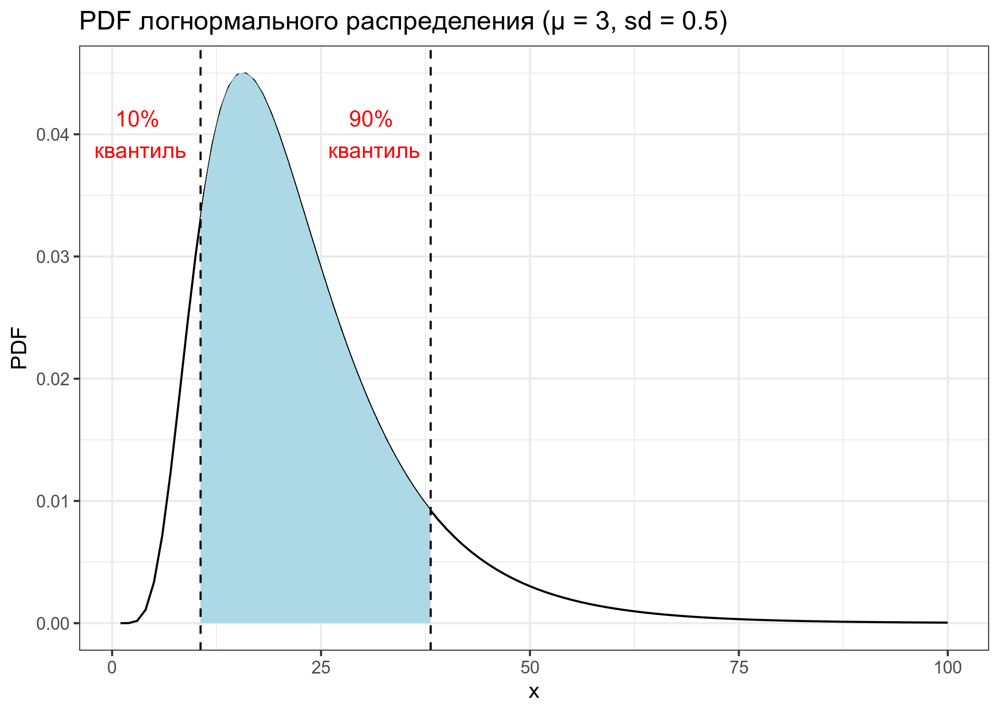
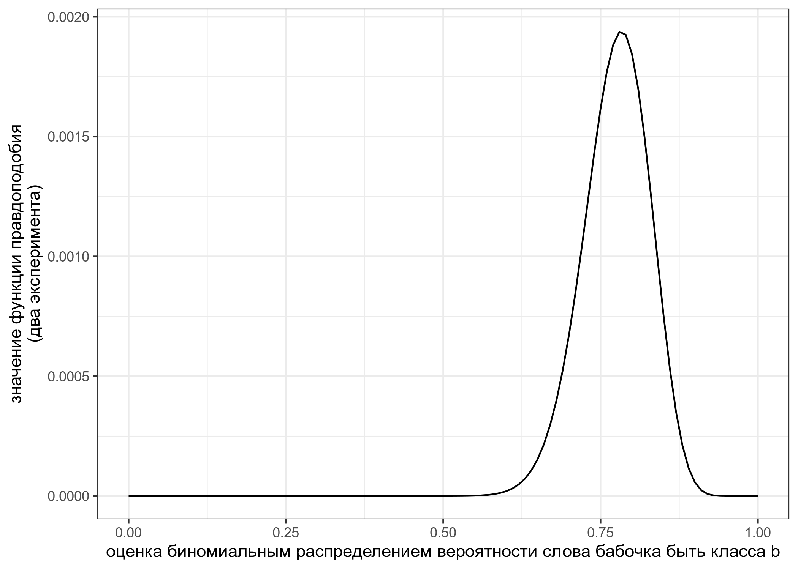
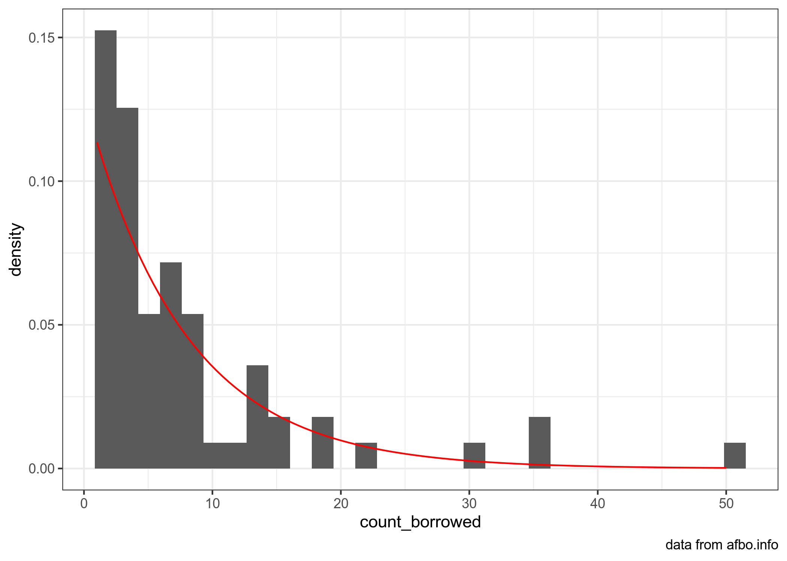

```{r, message=FALSE}
library(tidyverse)
theme_set(theme_bw())
```

Это [rmarkdown](https://rmarkdown.rstudio.com/) документ. Чтобы его скомпилировать, можно нажать в RStudio кнопку Knit. Вставьте ваше имя в заголовок, а код в соответствующие фрагменты, выделенные знаками `.

## task 1.1

Дан график логнормального распределения с лог-средним 3 и лог-стандартным отклонением 0.5. Посчитайте закрашенную площадь под кривой. В ответе выведите в консоль значение с точностью до трех знаков после запятой.



```{r}
lower <-  qlnorm(0.1, mean = 3, sd = 0.5)
upper <- qlnorm(0.9, mean = 3, sd = 0.5)
res <- plnorm(upper, mean = 3, sd = 0.5) - plnorm(lower, mean = 3, sd = 0.5)
round(res, 3)
```

или так
```{r}
integrate(function(x){dlnorm(x, 3, 0.5)}, 
          qlnorm(0.1, mean = 3, sd = 0.5), 
          qlnorm(0.9, mean = 3, sd = 0.5))$value %>% 
  round(3)
```

## task 1.2

В работе [Moroz, Verhees 2019] исследовалась вариативность классовой атрибуции в андийском языке и выяснилось, что 9 носителей относят слово *бабочка* к классу *b* и 7 носиителей относят слово к классу *r*. В новой итерации эксперимента 38 носителей отнесли слово *бабочка*  к классу *b* и 6 носителей отнесли слово к классу *r*. Визуализируйте функцию правдоподобия и посчитайте какой из вариантов, заданный функцией `seq(0, 1, by = 0.01)`, имеет наибольшее значение функции правдоподобия.



```{r}
p <- seq(0, 1, by = 0.01)

tibble(p) %>% 
  ggplot(aes(p)) +
  stat_function(fun = function(p) dbinom(9, 9+7, p)*dbinom(38, 38+6, p))+
  labs(x = "оценка биномиальным распределением вероятности слова бабочка быть класса b",
       y = "значение функции правдоподобия\n(два эксперимента)")


values <- dbinom(9, 9+7, p) * dbinom(38, 38+6, p)
i <- which.max(values)
p[i]
```

## task 1.3

[В датасете](https://afbo.info/pairs.csv?sEcho=1&iSortingCols=1&iSortCol_0=0&sSortDir_0=asc) собраны данные из базы данных [AfBo](https://afbo.info/). В этой базе данных собрана информация о том, какие языки из каких языков заимствовавали суффиксы. Скачайте данные, отфильтруйте ниболее достоверные значения (т. е. такие, чтобы в переменной `reliability` было значение `high`), воспользуйтесь методом максимального правдоподобия, чтобы оценить параметры экспоненциального распределения (смотрите справку командой `?dexp`), описывающего распределение количества заимствованных суфиксов (переменная `count_borrowing`), а потом визуализируйте данные и найденное распределение.



```{r}
library(fitdistrplus)
```

```{r}
read_csv("https://afbo.info/pairs.csv?sEcho=1&iSortingCols=1&iSortCol_0=0&sSortDir_0=asc") %>% 
  filter(reliability == "high") ->
  afbo_filtered

exp <- fitdist(afbo_filtered$count_borrowed, distr = "exp", method = "mle")

afbo_filtered %>% 
  ggplot(aes(count_borrowed))+
  geom_histogram(aes(y = ..density..))+
  stat_function(fun = dexp, args = exp$estimate, color = "red")
  labs(caption = "data from afbo.info")
ggsave("task_1.3.png", device = "png")

```